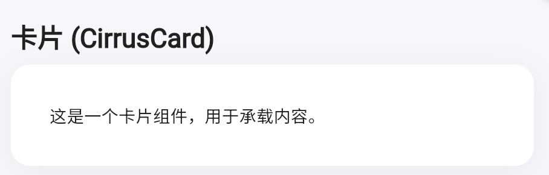

# Cirrus UI System

[](https://pub.dev/packages/cirrus)
[](https://github.com/ycccccccy/cirrus/blob/main/LICENSE)

---

**English** | [**中文**](./README_zh.md)

Cirrus is an enterprise-grade Flutter UI system designed to be a powerful alternative to the standard Material Design library. While built upon the solid foundation of Material 3, Cirrus extensively redesigns, enhances, and expands the component suite to deliver a unique, highly opinionated.

Our goal is to provide a complete toolkit that covers every component a developer might need, offering superior aesthetics and a more refined developer experience out of the box.

## ✨ Core Philosophy

- **Beyond Material**: We don't just theme M3; we rebuild and enhance it. Cirrus has its own opinionated design and aims for complete component coverage.
- **Design-Driven**: Every component is meticulously crafted with attention to detail, animation, and interaction to achieve an elegant and modern look.
- **Developer-First**: A clean, intuitive, and type-safe API that makes building complex UIs a delightful experience.
- **Out-of-the-Box**: Ships with a unified `CirrusTheme` and enables Material 3 by default, providing best practices with zero configuration.

## 🎨 Component Showcase

Here are some of the key components available in Cirrus.

| Component       | Preview                                       |
| :-------------- | :-------------------------------------------- |
| **Buttons**     |          |
| **Cards**       |              |
| **Dialogs**     |          |
| **Text Fields** |  |
| **TabBar**      |        |

_Note: The images above are placeholders. Please replace them with actual screenshots of your components._

## 🚀 Getting Started

### Installation

Add this to your package's `pubspec.yaml` file:

```yaml
dependencies:
  cirrus: ^0.0.1 # Use the latest version from pub.dev
```

### Usage

First, apply the `CirrusTheme` to your `MaterialApp`:

```dart
import 'package:cirrus/cirrus.dart';

void main() {
  runApp(const MyApp());
}

class MyApp extends StatelessWidget {
  const MyApp({super.key});

  @override
  Widget build(BuildContext context) {
    return MaterialApp(
      // Apply the unified Cirrus theme
      theme: CirrusTheme.themeData,
      home: const HomePage(),
    );
  }
}
```

Now you can use the Cirrus widgets anywhere in your app.

## 🤝 Contributing

Contributions, issues, and feature requests are welcome!

## 📄 License

This project is licensed under the MIT License.
